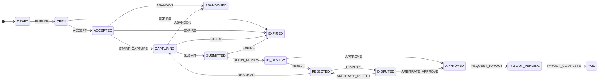

# dataquest-task-lifecycle

Task lifecycle state machine for a two-sided human-data marketplace,
reproduced from the **DataQuest** portfolio case study (human-action data
marketplace for embodied AI). Covers the full path from task creation to
payout, plus the edge cases the case study calls out: **abandonment**,
**expiration**, and **dispute resolution**.

TypeScript, zero runtime dependencies.

## Install

Node.js ≥ 20.

```bash
npm install
npm run build
npm test   # all tests, all local
```

Prefer the demo: `npm run demo` builds, then runs `dist/src/demo.js` — one task
through the full `DRAFT → PAID` chain with the append-only audit history
printed to stdout.

## Quickstart

```ts
import { TaskLifecycle } from "./dist/index.js";

const task = new TaskLifecycle("task-042");
task.dispatch("PUBLISH", { actor: "researcher" });
task.dispatch("ACCEPT", { actor: "contributor" });
task.dispatch("START_CAPTURE", { actor: "contributor" });
task.dispatch("SUBMIT", { actor: "contributor" });
task.dispatch("BEGIN_REVIEW", { actor: "reviewer" });
task.dispatch("APPROVE", { actor: "reviewer", note: "meets rubric" });
task.dispatch("REQUEST_PAYOUT", { actor: "contributor" });
task.dispatch("PAYOUT_COMPLETE", { actor: "system" });
console.log(task.state); // PAID
```

## State machine

The diagram below is generated from the `transitionTable()` single source of
truth — regenerate it any time with `npm run diagram` (prints the block to
stdout; `node dist/src/diagram.js --check` exits 1 if the README copy
drifts; `--write <file>` writes bare mermaid source for standalone `.mmd`
use). `test/stateDiagram.test.ts` and `test/diagram.test.ts` fail the build
if the README copy or any rendered edge ever drifts from `transition()`
behavior.



- `transition(state, event)` is a pure function; invalid transitions throw.
- `TaskLifecycle` wraps it with an append-only history: each entry has
  (seq, event, from → to, ISO timestamp), optional (actor, note,
  payoutRef, payoutAmount), and a `prevHash`/`hash` SHA-256 audit chain.
- `allowedEvents(state)` / `isTerminal(state)` helpers for UI gating.
- Terminal states: `PAID`, `ABANDONED`, `EXPIRED`.
- `transitionTableJson()` exports the whole transition table as canonical
  JSON; `test/__snapshots__/transitionTable.snapshot.json` is the committed
  snapshot (`test/transitionSnapshot.test.ts` fails if the table ever
  changes without regenerating it).

## SLA deadlines

A state may carry an optional SLA deadline (`TaskLifecycle.setSlaDeadline`,
per-state, stored as normalized ISO). `isOverdue(task, now)` answers
"is the task past its deadline right now" — `false` when no deadline is
set, `false` in terminal states, and true at/after the deadline.

Relationship to `EXPIRE`: the deadline is **advisory only** and never moves
the task by itself — there is no timer, no background scheduler. Expiry
stays an explicit `EXPIRE` event so it lands in the append-only history. The
intended wiring is a watchdog (cron, queue consumer) that polls
`isOverdue()` and dispatches `EXPIRE` itself, which is exactly what
`test/sla.test.ts` demonstrates in its last case.

For batch polling there is a dedicated helper — `expiredTasks(tasks, now)`
returns the "non-terminal and past deadline" subset of a task list. It is a
pure filter (it never mutates or dispatches); the watchdog executor
`expireOverdueTasks(tasks, now)` does the dispatch for you, one line:

```ts
import { expireOverdueTasks, TaskLifecycle } from "./src/index.js";

const tasks: TaskLifecycle[] = loadTasks(); // your store
const outcomes = expireOverdueTasks(tasks); // [{ task, expired: true }, …]
// { task, expired: false, error } — see below
```

Why the executor exists instead of a hand-written loop: `expiredTasks()`
only checks the deadline and the terminal flag, but `EXPIRE` is **not** a
legal event from every non-terminal state — the transition table only has
`EXPIRE` edges on OPEN, ACCEPTED, CAPTURING and SUBMITTED. An overdue
IN_REVIEW task (or a deadline set on any other state without the edge)
makes `task.dispatch("EXPIRE")` throw
`invalid transition: EXPIRE from IN_REVIEW`, aborting a naive
`for (const task of expiredTasks(tasks)) task.dispatch("EXPIRE")` loop on
the first such task. `expireOverdueTasks` catches that error per task —
`{ task, expired: false, error: <message> }` — and keeps going, so one
unexpirable task never blocks the rest of the batch. Only overdue
(non-terminal, past deadline) tasks are attempted; nothing auto-migrates,
every expiry is an explicit dispatch that lands in the append-only
history.

A related but distinct screening is `staleTasks(tasks, maxAgeByState, now)`
— it finds tasks stuck in their *current* non-terminal state longer than a
per-state budget, measured from the last history entry's timestamp. That is
the watchdog for "nobody picked up this OPEN task in a month" or "this
review has been pending a week", as opposed to "this task passed an absolute
deadline". Terminal states and states with no configured budget are never
selected; the helper is pure (never mutates or dispatches), and invalid
budget configuration fails fast with `invalid maxAgeByState: …`:

```ts
import { staleTasks, TaskLifecycle } from "./src/index.js";

const tasks: TaskLifecycle[] = loadTasks(); // your store
const stale = staleTasks(tasks, {
  IN_REVIEW: 7 * 24 * 3600_000, // a week
  OPEN: 30 * 24 * 3600_000,    // a month
});
for (const task of stale) {
  task.dispatch("ABANDON", { actor: "system" }); // or page a human, not expire
}
```

## Persistence

A task can be exported to plain JSON and rebuilt later — no database
built in, you choose the store:

```ts
const task = new TaskLifecycle("task-042");
task.dispatch("PUBLISH", { actor: "researcher" });
task.setSlaDeadline("2026-12-01T00:00:00.000Z"); // advisory SLA deadline

// snapshot: { id, state, history, slaDeadlines, [maxResubmits],
//   [maxDisputes], [rolePolicy] } — plain JSON, no Maps, no class
//   instances. The bracketed fields appear only when the corresponding
//   option is configured (see TaskSnapshot). Also what
//   JSON.stringify(task) produces.
const snapshot = task.toJSON();
await db.save(snapshot);

// restore later, in another process:
const restored = TaskLifecycle.fromJSON(await db.load("task-042"));
restored.dispatch("ACCEPT"); // history continues at seq 3, no gaps
```

`TaskLifecycle.fromJSON()` is defensive by design: it validates the
untrusted snapshot against the same audit invariants the tests enforce —
seq restarts at 1 with no gaps, the from/to chain is continuous and starts
at `DRAFT`, every `(from, event) → to` edge is a legal transition, and
timestamps are canonical ISO-8601 and non-decreasing. SLA deadline strings
are normalized exactly like `setSlaDeadline` does. Malformed or
inconsistent input throws a specific `invalid snapshot: …` error instead
of producing a task with a broken audit trail. See
`test/serialization.test.ts` for the full checklist.

### Hash-chained audit history

Every entry `dispatch()` appends carries `prevHash` and `hash`:
`prevHash` is the previous entry's `hash` (the genesis entry's is the
exported `GENESIS_PREV_HASH` constant, `"GENESIS"`), and
`hash = sha256(canonical(entry sans hash) + prevHash)` via `node:crypto`
— the same convention the sibling `escrow-state-machine-ts` repo uses.
`parseHistory()` re-verifies the chain whenever entries carry it, so a
persisted snapshot or NDJSON line that was rewritten, deleted from the
middle, or reordered fails rehydration (`invalid history: history hash
chain is broken`) instead of replaying as a clean log; a history mixing
chained and hashless entries is rejected outright. Histories produced
before this feature (no hash fields) still parse — `fromJSON()` /
`fromHistory()` chain them deterministically on rehydration, so the live
history is always fully chained.

Verify a log without rehydrating:

```ts
import { verifyHistoryChain } from "dataquest-task-lifecycle";

verifyHistoryChain(log); // true when intact; false on tampering, deletion, or reordering
```

Honest limit: this is an *unkeyed* chain. It detects edits by anyone who
rewrites entries without recomputing the chain (manual edits,
log-shipper corruption, partial restores). It does not stop an attacker
who rewrites the whole log and recomputes the hashes — that needs a
keyed MAC or signatures.

### Event-sourced replay

When only the raw audit log survives (e.g. an event stream, a forwarded
batch), the history alone is enough to rebuild the task — no snapshot
envelope needed, and no `state` field to trust:

```ts
import { TaskLifecycle, replay } from "dataquest-task-lifecycle";

const log = await eventStore.read("task-042"); // plain JSON entries

replay(log); // => "PAID" (pure: just the final state)

const task = TaskLifecycle.fromHistory("task-042", log);
task.dispatch("ACCEPT"); // history continues at the next seq, no gaps
```

### NDJSON history export

When the audit log must travel as a line-delimited stream (log
shippers, batch forwarders, one event per line in a store), export and
re-import it without losing the integrity checks:

```ts
import { historyFromNdjson, historyToNdjson, replay } from "dataquest-task-lifecycle";

const lines = historyToNdjson(task); // "…\n…\n…\n" — canonical key order per line
await stream.write(lines);

const entries = historyFromNdjson(await stream.readAll());
replay(entries); // => "PAID"
```

`historyToNdjson` validates the entries with the same
`parseHistory` checklist before serializing, so a broken history
refuses to export instead of producing a file that could never be
re-imported. `historyFromNdjson` skips blank lines, accepts `\r\n`,
and attributes every failure to its 1-based line number
(`invalid ndjson: line 7: …` — the entry index shifts when blank
lines are present, the line number does not).

Every entry is validated with the same audit invariants as `fromJSON()`
(seq continuity, from/to chain, legal edges, canonical ISO timestamps) —
a broken log throws a specific `invalid history: …` error instead of a
guessed state. Replay restores state + history only: the task id is not
recoverable from the log (entries carry no id), so it is passed
explicitly, and advisory SLA deadlines are not part of the audit log, so
they are not restored (use `fromJSON()` for the full snapshot).

## Settlement payout references

`dispatch(event, { payoutRef })` records an external payment reference
(payout batch id, transfer id, …) verbatim into the audit entry — a
typed, queryable field for settlement reconciliation, instead of
free-text `note`:

```ts
const task = new TaskLifecycle("task-042");
/* … DRAFT → APPROVED … */
task.dispatch("REQUEST_PAYOUT", { actor: "contributor", payoutRef: "batch-2026-1006" });
task.dispatch("PAYOUT_COMPLETE", { actor: "system", payoutRef: "xfer-88f2" });
task.history[7].payoutRef; // => "xfer-88f2"
```

`payoutRef` must be a non-empty string; anything else throws
`invalid dispatch options: …` before the entry is appended, like
actor/note. The reference survives `toJSON()` / `fromJSON()` and
`fromHistory()` round-trips (an empty or non-string `payoutRef` in an
untrusted snapshot is rejected as `invalid history`), and it is
preserved by the NDJSON export.

Honest limit: a `PAYOUT_COMPLETE` without a `payoutRef` is legal —
advisory only, not enforced. The library cannot verify whether an
external payment actually happened, so requiring the field would be a
guess, not a guarantee. Deployments whose payout flow always produces a
reference can opt in to up-front enforcement instead: constructing the
task with `new TaskLifecycle(id, { requirePayoutRef: true })` makes a
`PAYOUT_COMPLETE` dispatch without a `payoutRef` throw
`payout reference required: …` (checked after the transition/budget
checks, before anything is appended — a rejected dispatch leaves no
trace). The switch is task configuration, not audit data: it is never
written into the `toJSON()` snapshot, so a restored task re-enables it
via `fromHistory(id, history, { requirePayoutRef: true })`. For the other
half of the loop, the
`unreconciledPayouts()` reconciliation helper flags `PAID` tasks whose
`PAYOUT_COMPLETE` entry lacks one:

```ts
import { unreconciledPayouts } from "dataquest-task-lifecycle";

// PAID tasks whose PAYOUT_COMPLETE entry has no payoutRef — settlements
// that still need chasing. Pure: reads the tasks, never mutates them.
for (const task of unreconciledPayouts(allTasks)) {
  alertFinance(task.id, "paid without a recorded payout reference");
}
```

A reference on `REQUEST_PAYOUT` alone does not reconcile the task: the
check reads the `PAYOUT_COMPLETE` entry (the one that moved the task to
`PAID`), because that is the entry that evidences the settlement itself.

### Payout amounts

A `payoutRef` answers "was there a transfer id"; finance reconciliation
also needs "how much actually settled". `dispatch(event, { payoutAmount })`
records the settled amount verbatim on the audit entry — the `payoutRef`
companion for money:

```ts
task.dispatch("PAYOUT_COMPLETE", {
  actor: "system",
  payoutRef: "xfer-88f2",
  payoutAmount: 10098.5,
});
task.history[8].payoutAmount; // => 10098.5
```

`payoutAmount` must be a finite number ≥ 0; anything else throws
`invalid dispatch options: …` before the entry is appended, like
payoutRef. It is generic audit metadata (accepted on any event), but
intended for `PAYOUT_COMPLETE`; it survives `toJSON()` / `fromJSON()` and
NDJSON round-trips, is committed into the audit-history hash chain, and
an untrusted snapshot carrying a malformed value is rejected as
`invalid history`. The `totalPaidOut()` helper sums it across `PAID`
tasks:

```ts
import { totalPaidOut } from "dataquest-task-lifecycle";

totalPaidOut(allTasks); // => 20630.0 — sum of recorded PAYOUT_COMPLETE amounts
```

Honest accounting rules: only `PAID` tasks contribute; a `PAID` task
whose `PAYOUT_COMPLETE` entry carries no `payoutAmount` contributes 0 —
this sums only what was recorded, not what was owed; the returned total
is rounded to cents (`Math.round(x * 100) / 100`, the same money
convention as the sibling escrow-state-machine-ts) while per-entry
amounts are stored verbatim.

### Payout webhooks

The in-process `subscribe()` hook cannot notify anything outside the
process. `buildPayoutWebhook(task, secret)` closes that gap for the
payout path: it derives a compact signed notification from a `PAID`
task's audit history — the dataquest-side peer of escrow's
`src/webhooks.ts`:

```ts
import { buildPayoutWebhook, verifyPayoutWebhook } from "dataquest-task-lifecycle";

const { payload, signature } = buildPayoutWebhook(paidTask, webhookSecret);
// payload: { event: "PAYOUT_COMPLETE", taskId, payoutRef?, payoutAmount?, at, eventId }
// signature: "sha256=<hex>"
```

`eventId` defaults to `crypto.randomUUID()` — receivers MUST deduplicate
on it, because a retried delivery would otherwise look like a second
payout. `verifyPayoutWebhook(rawBody, signature, secret)` checks the
HMAC-SHA256 in constant time and returns a boolean; malformed signatures
return `false` instead of throwing. Verify over the raw request body
bytes — the object overload re-stringifies for in-process convenience,
but bytes are the transport-safe path.

Honest limits: the payload carries only what the audit history records —
`payoutRef`/`payoutAmount` are omitted when the entry lacks them (a `PAID`
task with no ref still builds; a missing reference is unevidenced, not a
build failure). Secret distribution is the caller's responsibility, and
this module does not POST anything: delivery and retries stay the
caller's job (escrow has `deliverSettlementWebhook`; this repo does not
yet).

## Dispatch idempotency keys

Payment flows retry webhooks, and a retried dispatch used to mean a
duplicate audit entry. `dispatch(event, { idempotencyKey })` fixes that:
the task remembers every key consumed by a successful dispatch, and a
repeat with a known key is a full no-op — it returns the current state,
appends nothing, notifies no listeners, and does not even validate the
transition (safe to replay after the task has moved on):

```ts
task.dispatch("PUBLISH", { idempotencyKey: "webhook-dlv-9f3a" });
task.dispatch("PUBLISH", { idempotencyKey: "webhook-dlv-9f3a" }); // no-op
task.history.length; // => 1
```

Keys are global to the task, not per-event: reusing the same key for a
different event still dedupes. The key itself must be a non-empty string
(else `invalid dispatch options: …` up front). Failed dispatches consume
nothing — fix the bad call and retry with the same key and it executes.
Omitting the key preserves the exact pre-idempotency behavior.

Honest limit: the key set is in-memory only. It does not survive
`toJSON()` / `fromJSON()` / `fromHistory()` — a rehydrated task restarts
with an empty set, so a retry with the same key re-executes after a
restart. For cross-restart exactly-once semantics, pair this with a
durable store (e.g. a `UNIQUE` constraint on the key column).

## Retry budgets

A task can cap how many times it may be resubmitted — the production
"bound appeals" habit, as a task-level policy:

```ts
const task = new TaskLifecycle("task-042", { maxResubmits: 2 });
// …REJECTED → RESUBMIT → CAPTURING → … → REJECTED → RESUBMIT → …
// the third dispatch("RESUBMIT") throws:
//   resubmit budget exhausted: 2 of 2 RESUBMITs already used
```

`maxResubmits` defaults to unlimited (the pre-budget behavior is
unchanged) and must be a non-negative integer or `Infinity`. The used
count is derived from the append-only history — the audit entries are the
source of truth — so it survives persistence with the budget: `toJSON()`
stores the finite budget in the snapshot envelope, and `fromJSON()` /
`TaskLifecycle.fromHistory(id, log, { maxResubmits })` rehydrate it
without resetting either. The check runs after the transition legality
check and before anything is appended, so a rejected dispatch leaves no
trace in the history.

## Dispute budgets

The transition table lets the appeal path (REJECTED → DISPUTED →
ARBITRATE_REJECT → REJECTED) loop without limit; a task can cap how many
appeal rounds it may run — the production "bound appeals" habit, as a
task-level policy:

```ts
const task = new TaskLifecycle("task-042", { maxDisputes: 1 });
// …REJECTED → DISPUTE → DISPUTED → ARBITRATE_REJECT → REJECTED…
// the second dispatch("DISPUTE") throws:
//   dispute budget exhausted: 1 of 1 DISPUTEs already used
```

`maxDisputes` defaults to unlimited (the pre-budget behavior is
unchanged) and must be a non-negative integer or `Infinity`. The used
count is derived from the append-only history — the audit entries are the
source of truth — so it survives persistence with the budget: `toJSON()`
stores the finite budget in the snapshot envelope, and `fromJSON()` /
`TaskLifecycle.fromHistory(id, log, { maxDisputes })` rehydrate it
without resetting either. The check runs after the transition legality
and RBAC checks and before anything is appended, so a rejected dispatch
leaves no trace in the history. It is independent of `maxResubmits`: the
two budgets govern disjoint events on the same task.

## Event-level RBAC

Tasks can gate individual events on named actors — the "only a senior
moderator may arbitrate" rule from the case study, as task configuration:

```ts
const task = new TaskLifecycle("task-042", {
  rolePolicy: {
    ARBITRATE_APPROVE: ["senior-moderator"],
    ARBITRATE_REJECT: ["senior-moderator"],
    PUBLISH: ["researcher", "admin"],
  },
});
task.dispatch("ARBITRATE_APPROVE", { actor: "contributor" });
// throws: actor not authorized for ARBITRATE_APPROVE: "contributor" is not in [senior-moderator]
```

Rules: the policy is `Partial<Record<TaskEvent, string[]>>` — events it
does not list are unrestricted (no actor needed), and a task built
without a policy behaves exactly as before. A listed event requires an
`actor` that exactly matches one of the allowed names (case-sensitive);
missing or non-matching actors throw `actor not authorized for …`, after
the transition legality check and before anything is appended, so rejected
dispatches leave no history trace. Invalid policies (unknown events,
empty or non-string role lists) throw `invalid option: rolePolicy …` at
construction. The policy survives `toJSON()`/`fromJSON()` (tampered
policies in stored snapshots are rejected) and re-attaches via
`TaskLifecycle.fromHistory(id, log, { rolePolicy })`.

Honest caveat: this is a caller-supplied allowlist, not identity — the
library records the actor string it is given but cannot verify who
"senior-moderator" really is. It guarantees policy violations never
dispatch and every allowed dispatch is audited with its actor string.

## Dispatch subscriptions

`dispatch()` has an in-process notification seam — the starting point
for notification fan-out (emails, Slack pings, queue messages), which
callers build on top:

```ts
const task = new TaskLifecycle("task-042");
const unsub = task.subscribe((event, from, to, entry) => {
  // fire-and-forget: hand off to your notifier here
  console.log(`${event}: ${from} -> ${to} (seq ${entry.seq})`);
});
task.dispatch("PUBLISH", { actor: "researcher" }); // listener runs here
unsub();
```

Rules: listeners run **after** the audit entry is appended, in
subscription order, and receive the exact entry (a frozen, detached
copy — listeners cannot rewrite the audit trail). Failed dispatches
notify nobody. A listener that throws is **isolated**: the error is
swallowed, the remaining listeners still run, and dispatch returns
normally — a bad fan-out consumer can never break the state machine or
corrupt the history. That silence is deliberate by default, but you can
opt into visibility without wrapping every listener yourself:

```ts
const unsub = task.subscribe(
  (event, from, to, entry) => notifier.send(`${event}: ${from} -> ${to}`),
  {
    onError: (err, { event, from, to }) => {
      // called with the exact thrown error and the dispatch context
      logger.error("fan-out consumer failed", { err, event, from, to });
    },
  },
);
```

Isolation semantics are unchanged by `onError`: the error is still
swallowed after the hook runs, and a throwing `onError` is swallowed
too — no error hook can ever break dispatch or starve peers.
Invalid options (non-object `opts`, non-function `onError`) fail fast
with a clear `invalid subscribe: …` error.

Honest caveat: subscriptions are in-memory only — they do not survive
`toJSON()`/`fromJSON()`/`fromHistory()` (rehydrated tasks start with
zero listeners), and the library provides no durable fan-out (queues,
webhooks, retries). That remains the caller's infrastructure.

## Limitations (honest)

- **Off-chain reproduction.** The case study is a product-design artifact;
  this models the *rules* of the lifecycle, not a production backend.
  `toJSON()` / `fromJSON()` export and rehydrate in-memory snapshots (see
  "Persistence") — there is still no built-in store, no identity layer
  (event-level RBAC is a caller-supplied actor allowlist, not
  authentication — see "Event-level RBAC"), no
  deadline scheduler (expiry is an explicit event, not a timer). In-process
  dispatch subscriptions exist (`task.subscribe` — fire-and-forget,
  listener errors swallowed, not persisted); there is still no durable
  notification fan-out (queues, retries, delivery). Webhook-shaped
  payout *signing* does exist — `buildPayoutWebhook`/
  `verifyPayoutWebhook` derive and HMAC-sign a `PAYOUT_COMPLETE`
  notification from a PAID task's audit history — but actually POSTing it
  stays the caller's job.
- **Simplified arbitration.** Appeal rounds (REJECTED → DISPUTED →
  arbitration → REJECTED) can be capped per task with `maxDisputes`
  (default unlimited; used-round count derived from the append-only
  history so it survives persistence) — see "Dispute budgets" above.
  Production would additionally add per-state retry budgets and keep the
  bound in a durable policy store rather than task configuration. (Task-level
  RESUBMIT retry budgets exist since v0.1.0 — see "Retry budgets" above;
  per-state SLA deadlines also exist — see "SLA deadlines"; expiry remains
  explicit.)
- **No reputation/quality scoring.** The case study's contributor tiers and
  earnings wallet are out of scope here.
- **Append-only history is runtime-frozen.** `task.history` returns a frozen
  copy (array and entries), so consumers cannot rewrite the audit log at
  runtime, even by accident — `dispatch()` is the only append path. This is
  in-memory integrity, not tamper-proofing: persisted snapshots and NDJSON
  exports additionally carry a SHA-256 hash chain (`prevHash`/`hash` on
  every entry, genesis links to `"GENESIS"`), which `parseHistory()`
  re-verifies on rehydration — a rewritten, truncated, or reordered
  persisted log fails loudly. The chain is unkeyed: it catches edits made
  without recomputing the hashes, not a full-log rewrite by someone who
  recomputes them (that needs a keyed MAC or signatures).

## Reproducibility

`npm test` runs 282 tests covering the happy path, reject→resubmit
(including the RESUBMIT retry budget: budget enforcement, invalid
budgets, and snapshot round-trips that preserve the budget and used
count), the DISPUTE appeal budget (`maxDisputes`: budget enforcement,
exhaustion-before-append semantics, invalid-budget rejection, snapshot
round-trips that preserve the budget and used count, `fromHistory`
re-attachment, and independence from the RESUBMIT budget),
dispute→arbitration (both outcomes, plus event-level RBAC: moderator-only
arbitration, partial policies, exact actor matching, and policy
persistence round-trips), abandonment, expiration, SLA
deadlines and overdue checks, JSON snapshot persistence
(round-trip, detached copies, and rejection of 18 malformed-snapshot
shapes), event-sourced replay (golden paths, input detachment, and 10
malformed-history shapes), invalid transitions, terminal-state
locking, the README-diagram sync guard, the `npm run diagram` CLI
output, audit-history integrity (seq increment, from/to chain continuity,
canonical ISO timestamps, no partial entry on failed dispatch,
dispatch actor/note input validation (non-empty actor, `MAX_NOTE_LENGTH`
note cap, rejection of oversized/untrusted entries, no-trace fail-fast),
injected dispatch timestamp (`at`:
canonical ISO-8601, non-decreasing vs. the previous entry, fail-fast
before the transition check), runtime
freeze of the returned history), dispatch subscription hooks (order,
unsubscribe, listener-error isolation, frozen detached entries,
in-memory-only semantics, plus the optional `onError` observability hook:
context delivery, peer isolation preserved, throwing `onError`
containment, unsubscribe semantics, invalid-option fail-fast), stale-task watchdog screening (`staleTasks`:
dwell budgets per state, terminal/history-less exclusion, invalid-budget
fail-fast, purity), and per-edge agreement between the rendered
diagram and `transition()`. Settlement payout references are covered too
(`payoutRef` verbatim recording, empty/non-string rejection fail-fast
before any mutation, `toJSON`/`fromJSON`/`fromHistory` round-trip
preservation, malformed-ref snapshot rejection, the no-ref
PAYOUT_COMPLETE advisory path, and the `requirePayoutRef` opt-in
enforcement: gate-on-PAYOUT_COMPLETE-only, non-boolean rejection at
construction, failed-dispatch key non-consumption, in-memory-only
switch semantics with `fromHistory` re-attachment), and settlement reconciliation screening
(`unreconciledPayouts`: mixed PAID batches, request-only refs not
reconciling, empty-input and purity, snapshot-rehydrated tasks), and
dispatch idempotency keys (duplicate no-op without transition validation,
per-task global keys, failed-dispatch key non-consumption, shape
validation, in-memory-only semantics, seq-continuity), payout amounts
(dispatch-time finite/≥0 validation with fail-fast semantics, verbatim
recording on the entry, toJSON/fromJSON round-trips, malformed-amount
snapshot rejection, hash-chain commitment, `totalPaidOut`: per-PAID-task
sums, unrecorded amounts as 0, non-PAID exclusion, cent-rounded totals,
purity), and the audit-history
SHA-256 hash chain (`verifyHistoryChain`: genesis linkage, tamper/deletion/
reorder/forgery detection, legacy pass-through, mixed-history rejection,
parseHistory/replay enforcement, NDJSON round-trip chain preservation,
legacy snapshot re-chaining on rehydration), and the overdue-expiry
watchdog executor (`expireOverdueTasks`: mixed-batch per-task outcomes,
unexpirable tasks never blocking the batch, failed tasks untouched,
auditable dispatch appends with an unbroken hash chain), and
documentation-shape coverage (the README claims about history-entry
fields and the snapshot shape are verified against `TaskHistoryEntry`
and `TaskSnapshot` in `src/taskLifecycle.ts`; no behavior changed in
this release). No
network, no randomness in assertions.

## License

MIT
