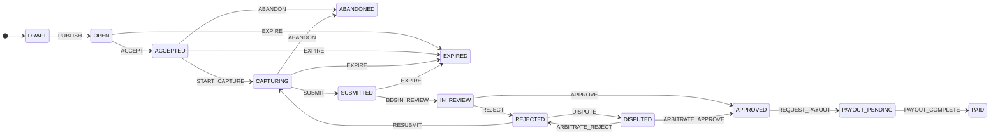

# dataquest-task-lifecycle

Task lifecycle state machine for a two-sided human-data marketplace,
reproduced from the **DataQuest** portfolio case study (human-action data
marketplace for embodied AI). Covers the full path from task creation to
payout, plus the edge cases the case study calls out: **abandonment**,
**expiration**, and **dispute resolution**.

TypeScript, zero runtime dependencies.

## Install

Node.js ≥ 20.

```bash
npm install
npm run build
npm test   # all tests, all local
```

Prefer the demo: `npm run demo` builds, then runs `dist/src/demo.js` — one task
through the full `DRAFT → PAID` chain with the append-only audit history
printed to stdout.

## Quickstart

```ts
import { TaskLifecycle } from "./dist/index.js";

const task = new TaskLifecycle("task-042");
task.dispatch("PUBLISH", { actor: "researcher" });
task.dispatch("ACCEPT", { actor: "contributor" });
task.dispatch("START_CAPTURE", { actor: "contributor" });
task.dispatch("SUBMIT", { actor: "contributor" });
task.dispatch("BEGIN_REVIEW", { actor: "reviewer" });
task.dispatch("APPROVE", { actor: "reviewer", note: "meets rubric" });
task.dispatch("REQUEST_PAYOUT", { actor: "contributor" });
task.dispatch("PAYOUT_COMPLETE", { actor: "system" });
console.log(task.state); // PAID
```

## State machine

The diagram below is generated by `stateDiagram()` in
`src/taskLifecycle.ts` (rendered from the `transitionTable()`
single source of truth); `test/stateDiagram.test.ts` fails the build if the
README copy ever drifts from the code.



- `transition(state, event)` is a pure function; invalid transitions throw.
- `TaskLifecycle` wraps it with an append-only history (seq, event,
  from → to, ISO timestamp, actor, note).
- `allowedEvents(state)` / `isTerminal(state)` helpers for UI gating.
- Terminal states: `PAID`, `ABANDONED`, `EXPIRED`.
- `transitionTableJson()` exports the whole transition table as canonical
  JSON; `test/__snapshots__/transitionTable.snapshot.json` is the committed
  snapshot (`test/transitionSnapshot.test.ts` fails if the table ever
  changes without regenerating it).

## SLA deadlines

A state may carry an optional SLA deadline (`TaskLifecycle.setSlaDeadline`,
per-state, stored as normalized ISO). `isOverdue(task, now)` answers
"is the task past its deadline right now" — `false` when no deadline is
set, `false` in terminal states, and true at/after the deadline.

Relationship to `EXPIRE`: the deadline is **advisory only** and never moves
the task by itself — there is no timer, no background scheduler. Expiry
stays an explicit `EXPIRE` event so it lands in the append-only history. The
intended wiring is a watchdog (cron, queue consumer) that polls
`isOverdue()` and dispatches `EXPIRE` itself, which is exactly what
`test/sla.test.ts` demonstrates in its last case.

## Limitations (honest)

- **Off-chain reproduction.** The case study is a product-design artifact;
  this models the *rules* of the lifecycle, not a production backend. No
  persistence, no auth/RBAC, no deadline scheduler (expiry is an explicit
  event, not a timer), no notification fan-out.
- **Simplified arbitration.** One appeal round is modeled; production would
  bound appeals and add per-state retry budgets. (Per-state SLA deadlines
  exist since v0.1.0 — see "SLA deadlines" above; expiry remains explicit.)
- **No reputation/quality scoring.** The case study's contributor tiers and
  earnings wallet are out of scope here.

## Reproducibility

`npm test` runs 25 tests covering the happy path, reject→resubmit,
dispute→arbitration (both outcomes), abandonment, expiration, SLA
deadlines and overdue checks, invalid transitions, terminal-state
locking, and the README-diagram sync guard. No network, no randomness in
assertions.

## License

MIT
