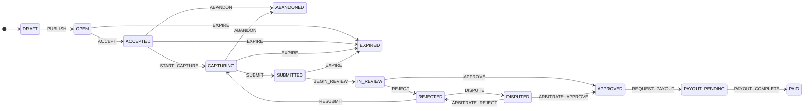

# dataquest-task-lifecycle

Task lifecycle state machine for a two-sided human-data marketplace,
reproduced from the **DataQuest** portfolio case study (human-action data
marketplace for embodied AI). Covers the full path from task creation to
payout, plus the edge cases the case study calls out: **abandonment**,
**expiration**, and **dispute resolution**.

TypeScript, zero runtime dependencies.

## Install

Node.js ≥ 20.

```bash
npm install
npm run build
npm test   # all tests, all local
```

Prefer the demo: `npm run demo` builds, then runs `dist/src/demo.js` — one task
through the full `DRAFT → PAID` chain with the append-only audit history
printed to stdout.

## Quickstart

```ts
import { TaskLifecycle } from "./dist/index.js";

const task = new TaskLifecycle("task-042");
task.dispatch("PUBLISH", { actor: "researcher" });
task.dispatch("ACCEPT", { actor: "contributor" });
task.dispatch("START_CAPTURE", { actor: "contributor" });
task.dispatch("SUBMIT", { actor: "contributor" });
task.dispatch("BEGIN_REVIEW", { actor: "reviewer" });
task.dispatch("APPROVE", { actor: "reviewer", note: "meets rubric" });
task.dispatch("REQUEST_PAYOUT", { actor: "contributor" });
task.dispatch("PAYOUT_COMPLETE", { actor: "system" });
console.log(task.state); // PAID
```

## State machine

The diagram below is generated from the `transitionTable()` single source of
truth — regenerate it any time with `npm run diagram` (prints the block to
stdout; `node dist/src/diagram.js --check` exits 1 if the README copy
drifts; `--write <file>` writes bare mermaid source for standalone `.mmd`
use). `test/stateDiagram.test.ts` and `test/diagram.test.ts` fail the build
if the README copy or any rendered edge ever drifts from `transition()`
behavior.



- `transition(state, event)` is a pure function; invalid transitions throw.
- `TaskLifecycle` wraps it with an append-only history (seq, event,
  from → to, ISO timestamp, actor, note).
- `allowedEvents(state)` / `isTerminal(state)` helpers for UI gating.
- Terminal states: `PAID`, `ABANDONED`, `EXPIRED`.
- `transitionTableJson()` exports the whole transition table as canonical
  JSON; `test/__snapshots__/transitionTable.snapshot.json` is the committed
  snapshot (`test/transitionSnapshot.test.ts` fails if the table ever
  changes without regenerating it).

## SLA deadlines

A state may carry an optional SLA deadline (`TaskLifecycle.setSlaDeadline`,
per-state, stored as normalized ISO). `isOverdue(task, now)` answers
"is the task past its deadline right now" — `false` when no deadline is
set, `false` in terminal states, and true at/after the deadline.

Relationship to `EXPIRE`: the deadline is **advisory only** and never moves
the task by itself — there is no timer, no background scheduler. Expiry
stays an explicit `EXPIRE` event so it lands in the append-only history. The
intended wiring is a watchdog (cron, queue consumer) that polls
`isOverdue()` and dispatches `EXPIRE` itself, which is exactly what
`test/sla.test.ts` demonstrates in its last case.

## Persistence

A task can be exported to plain JSON and rebuilt later — no database
built in, you choose the store:

```ts
const task = new TaskLifecycle("task-042");
task.dispatch("PUBLISH", { actor: "researcher" });
task.setSlaDeadline("2026-12-01T00:00:00.000Z"); // advisory SLA deadline

// snapshot: { id, state, history, slaDeadlines } — plain JSON, no Maps,
// no class instances. Also what JSON.stringify(task) produces.
const snapshot = task.toJSON();
await db.save(snapshot);

// restore later, in another process:
const restored = TaskLifecycle.fromJSON(await db.load("task-042"));
restored.dispatch("ACCEPT"); // history continues at seq 3, no gaps
```

`TaskLifecycle.fromJSON()` is defensive by design: it validates the
untrusted snapshot against the same audit invariants the tests enforce —
seq restarts at 1 with no gaps, the from/to chain is continuous and starts
at `DRAFT`, every `(from, event) → to` edge is a legal transition, and
timestamps are canonical ISO-8601 and non-decreasing. SLA deadline strings
are normalized exactly like `setSlaDeadline` does. Malformed or
inconsistent input throws a specific `invalid snapshot: …` error instead
of producing a task with a broken audit trail. See
`test/serialization.test.ts` for the full checklist.

### Event-sourced replay

When only the raw audit log survives (e.g. an event stream, a forwarded
batch), the history alone is enough to rebuild the task — no snapshot
envelope needed, and no `state` field to trust:

```ts
import { TaskLifecycle, replay } from "dataquest-task-lifecycle";

const log = await eventStore.read("task-042"); // plain JSON entries

replay(log); // => "PAID" (pure: just the final state)

const task = TaskLifecycle.fromHistory("task-042", log);
task.dispatch("ACCEPT"); // history continues at the next seq, no gaps
```

Every entry is validated with the same audit invariants as `fromJSON()`
(seq continuity, from/to chain, legal edges, canonical ISO timestamps) —
a broken log throws a specific `invalid history: …` error instead of a
guessed state. Replay restores state + history only: the task id is not
recoverable from the log (entries carry no id), so it is passed
explicitly, and advisory SLA deadlines are not part of the audit log, so
they are not restored (use `fromJSON()` for the full snapshot).

## Limitations (honest)

- **Off-chain reproduction.** The case study is a product-design artifact;
  this models the *rules* of the lifecycle, not a production backend.
  `toJSON()` / `fromJSON()` export and rehydrate in-memory snapshots (see
  "Persistence") — there is still no built-in store, no auth/RBAC, no
  deadline scheduler (expiry is an explicit event, not a timer), no
  notification fan-out.
- **Simplified arbitration.** One appeal round is modeled; production would
  bound appeals and add per-state retry budgets. (Per-state SLA deadlines
  exist since v0.1.0 — see "SLA deadlines" above; expiry remains explicit.)
- **No reputation/quality scoring.** The case study's contributor tiers and
  earnings wallet are out of scope here.

## Reproducibility

`npm test` runs 60 tests covering the happy path, reject→resubmit,
dispute→arbitration (both outcomes), abandonment, expiration, SLA
deadlines and overdue checks, JSON snapshot persistence
(round-trip, detached copies, and rejection of 18 malformed-snapshot
shapes), event-sourced replay (golden paths, input detachment, and 10
malformed-history shapes), invalid transitions, terminal-state
locking, the README-diagram sync guard, the `npm run diagram` CLI
output, audit-history integrity (seq increment, from/to chain continuity,
canonical ISO timestamps, no partial entry on failed dispatch), and per-edge agreement between the rendered diagram and
`transition()`. No network, no randomness in
assertions.

## License

MIT
