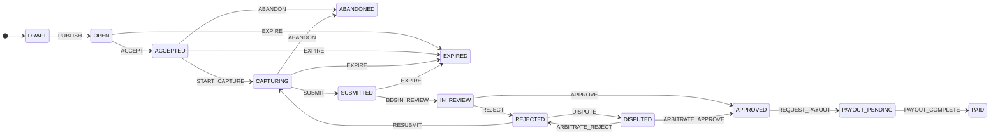

# dataquest-task-lifecycle

Task lifecycle state machine for a two-sided human-data marketplace,
reproduced from the **DataQuest** portfolio case study (human-action data
marketplace for embodied AI). Covers the full path from task creation to
payout, plus the edge cases the case study calls out: **abandonment**,
**expiration**, and **dispute resolution**.

TypeScript, zero runtime dependencies.

## Install

Node.js ≥ 20.

```bash
npm install
npm run build
npm test   # all tests, all local
```

Prefer the demo: `npm run demo` builds, then runs `dist/src/demo.js` — one task
through the full `DRAFT → PAID` chain with the append-only audit history
printed to stdout.

## Quickstart

```ts
import { TaskLifecycle } from "./dist/index.js";

const task = new TaskLifecycle("task-042");
task.dispatch("PUBLISH", { actor: "researcher" });
task.dispatch("ACCEPT", { actor: "contributor" });
task.dispatch("START_CAPTURE", { actor: "contributor" });
task.dispatch("SUBMIT", { actor: "contributor" });
task.dispatch("BEGIN_REVIEW", { actor: "reviewer" });
task.dispatch("APPROVE", { actor: "reviewer", note: "meets rubric" });
task.dispatch("REQUEST_PAYOUT", { actor: "contributor" });
task.dispatch("PAYOUT_COMPLETE", { actor: "system" });
console.log(task.state); // PAID
```

## State machine

The diagram below is generated from the `transitionTable()` single source of
truth — regenerate it any time with `npm run diagram` (prints the block to
stdout; `node dist/src/diagram.js --check` exits 1 if the README copy
drifts; `--write <file>` writes bare mermaid source for standalone `.mmd`
use). `test/stateDiagram.test.ts` and `test/diagram.test.ts` fail the build
if the README copy or any rendered edge ever drifts from `transition()`
behavior.



- `transition(state, event)` is a pure function; invalid transitions throw.
- `TaskLifecycle` wraps it with an append-only history (seq, event,
  from → to, ISO timestamp, actor, note).
- `allowedEvents(state)` / `isTerminal(state)` helpers for UI gating.
- Terminal states: `PAID`, `ABANDONED`, `EXPIRED`.
- `transitionTableJson()` exports the whole transition table as canonical
  JSON; `test/__snapshots__/transitionTable.snapshot.json` is the committed
  snapshot (`test/transitionSnapshot.test.ts` fails if the table ever
  changes without regenerating it).

## SLA deadlines

A state may carry an optional SLA deadline (`TaskLifecycle.setSlaDeadline`,
per-state, stored as normalized ISO). `isOverdue(task, now)` answers
"is the task past its deadline right now" — `false` when no deadline is
set, `false` in terminal states, and true at/after the deadline.

Relationship to `EXPIRE`: the deadline is **advisory only** and never moves
the task by itself — there is no timer, no background scheduler. Expiry
stays an explicit `EXPIRE` event so it lands in the append-only history. The
intended wiring is a watchdog (cron, queue consumer) that polls
`isOverdue()` and dispatches `EXPIRE` itself, which is exactly what
`test/sla.test.ts` demonstrates in its last case.

For batch polling there is a dedicated helper — `expiredTasks(tasks, now)`
returns the "non-terminal and past deadline" subset of a task list, so a
watchdog does it in one line (pure function: it never mutates or dispatches):

```ts
import { expiredTasks, TaskLifecycle } from "./src/index.js";

const tasks: TaskLifecycle[] = loadTasks(); // your store
for (const task of expiredTasks(tasks)) {
  task.dispatch("EXPIRE", { actor: "system" });
}
```

A related but distinct screening is `staleTasks(tasks, maxAgeByState, now)`
— it finds tasks stuck in their *current* non-terminal state longer than a
per-state budget, measured from the last history entry's timestamp. That is
the watchdog for "nobody picked up this OPEN task in a month" or "this
review has been pending a week", as opposed to "this task passed an absolute
deadline". Terminal states and states with no configured budget are never
selected; the helper is pure (never mutates or dispatches), and invalid
budget configuration fails fast with `invalid maxAgeByState: …`:

```ts
import { staleTasks, TaskLifecycle } from "./src/index.js";

const tasks: TaskLifecycle[] = loadTasks(); // your store
const stale = staleTasks(tasks, {
  IN_REVIEW: 7 * 24 * 3600_000, // a week
  OPEN: 30 * 24 * 3600_000,    // a month
});
for (const task of stale) {
  task.dispatch("ABANDON", { actor: "system" }); // or page a human, not expire
}
```

## Persistence

A task can be exported to plain JSON and rebuilt later — no database
built in, you choose the store:

```ts
const task = new TaskLifecycle("task-042");
task.dispatch("PUBLISH", { actor: "researcher" });
task.setSlaDeadline("2026-12-01T00:00:00.000Z"); // advisory SLA deadline

// snapshot: { id, state, history, slaDeadlines } — plain JSON, no Maps,
// no class instances. Also what JSON.stringify(task) produces.
const snapshot = task.toJSON();
await db.save(snapshot);

// restore later, in another process:
const restored = TaskLifecycle.fromJSON(await db.load("task-042"));
restored.dispatch("ACCEPT"); // history continues at seq 3, no gaps
```

`TaskLifecycle.fromJSON()` is defensive by design: it validates the
untrusted snapshot against the same audit invariants the tests enforce —
seq restarts at 1 with no gaps, the from/to chain is continuous and starts
at `DRAFT`, every `(from, event) → to` edge is a legal transition, and
timestamps are canonical ISO-8601 and non-decreasing. SLA deadline strings
are normalized exactly like `setSlaDeadline` does. Malformed or
inconsistent input throws a specific `invalid snapshot: …` error instead
of producing a task with a broken audit trail. See
`test/serialization.test.ts` for the full checklist.

### Event-sourced replay

When only the raw audit log survives (e.g. an event stream, a forwarded
batch), the history alone is enough to rebuild the task — no snapshot
envelope needed, and no `state` field to trust:

```ts
import { TaskLifecycle, replay } from "dataquest-task-lifecycle";

const log = await eventStore.read("task-042"); // plain JSON entries

replay(log); // => "PAID" (pure: just the final state)

const task = TaskLifecycle.fromHistory("task-042", log);
task.dispatch("ACCEPT"); // history continues at the next seq, no gaps
```

### NDJSON history export

When the audit log must travel as a line-delimited stream (log
shippers, batch forwarders, one event per line in a store), export and
re-import it without losing the integrity checks:

```ts
import { historyFromNdjson, historyToNdjson, replay } from "dataquest-task-lifecycle";

const lines = historyToNdjson(task); // "…\n…\n…\n" — canonical key order per line
await stream.write(lines);

const entries = historyFromNdjson(await stream.readAll());
replay(entries); // => "PAID"
```

`historyToNdjson` validates the entries with the same
`parseHistory` checklist before serializing, so a broken history
refuses to export instead of producing a file that could never be
re-imported. `historyFromNdjson` skips blank lines, accepts `\r\n`,
and attributes every failure to its 1-based line number
(`invalid ndjson: line 7: …` — the entry index shifts when blank
lines are present, the line number does not).

Every entry is validated with the same audit invariants as `fromJSON()`
(seq continuity, from/to chain, legal edges, canonical ISO timestamps) —
a broken log throws a specific `invalid history: …` error instead of a
guessed state. Replay restores state + history only: the task id is not
recoverable from the log (entries carry no id), so it is passed
explicitly, and advisory SLA deadlines are not part of the audit log, so
they are not restored (use `fromJSON()` for the full snapshot).

## Retry budgets

A task can cap how many times it may be resubmitted — the production
"bound appeals" habit, as a task-level policy:

```ts
const task = new TaskLifecycle("task-042", { maxResubmits: 2 });
// …REJECTED → RESUBMIT → CAPTURING → … → REJECTED → RESUBMIT → …
// the third dispatch("RESUBMIT") throws:
//   resubmit budget exhausted: 2 of 2 RESUBMITs already used
```

`maxResubmits` defaults to unlimited (the pre-budget behavior is
unchanged) and must be a non-negative integer or `Infinity`. The used
count is derived from the append-only history — the audit entries are the
source of truth — so it survives persistence with the budget: `toJSON()`
stores the finite budget in the snapshot envelope, and `fromJSON()` /
`TaskLifecycle.fromHistory(id, log, { maxResubmits })` rehydrate it
without resetting either. The check runs after the transition legality
check and before anything is appended, so a rejected dispatch leaves no
trace in the history.

## Event-level RBAC

Tasks can gate individual events on named actors — the "only a senior
moderator may arbitrate" rule from the case study, as task configuration:

```ts
const task = new TaskLifecycle("task-042", {
  rolePolicy: {
    ARBITRATE_APPROVE: ["senior-moderator"],
    ARBITRATE_REJECT: ["senior-moderator"],
    PUBLISH: ["researcher", "admin"],
  },
});
task.dispatch("ARBITRATE_APPROVE", { actor: "contributor" });
// throws: actor not authorized for ARBITRATE_APPROVE: "contributor" is not in [senior-moderator]
```

Rules: the policy is `Partial<Record<TaskEvent, string[]>>` — events it
does not list are unrestricted (no actor needed), and a task built
without a policy behaves exactly as before. A listed event requires an
`actor` that exactly matches one of the allowed names (case-sensitive);
missing or non-matching actors throw `actor not authorized for …`, after
the transition legality check and before anything is appended, so rejected
dispatches leave no history trace. Invalid policies (unknown events,
empty or non-string role lists) throw `invalid option: rolePolicy …` at
construction. The policy survives `toJSON()`/`fromJSON()` (tampered
policies in stored snapshots are rejected) and re-attaches via
`TaskLifecycle.fromHistory(id, log, { rolePolicy })`.

Honest caveat: this is a caller-supplied allowlist, not identity — the
library records the actor string it is given but cannot verify who
"senior-moderator" really is. It guarantees policy violations never
dispatch and every allowed dispatch is audited with its actor string.

## Dispatch subscriptions

`dispatch()` has an in-process notification seam — the starting point
for notification fan-out (emails, Slack pings, queue messages), which
callers build on top:

```ts
const task = new TaskLifecycle("task-042");
const unsub = task.subscribe((event, from, to, entry) => {
  // fire-and-forget: hand off to your notifier here
  console.log(`${event}: ${from} -> ${to} (seq ${entry.seq})`);
});
task.dispatch("PUBLISH", { actor: "researcher" }); // listener runs here
unsub();
```

Rules: listeners run **after** the audit entry is appended, in
subscription order, and receive the exact entry (a frozen, detached
copy — listeners cannot rewrite the audit trail). Failed dispatches
notify nobody. A listener that throws is **isolated**: the error is
swallowed, the remaining listeners still run, and dispatch returns
normally — a bad fan-out consumer can never break the state machine or
corrupt the history. That silence is deliberate; wrap your listener if
you need failure visibility.

Honest caveat: subscriptions are in-memory only — they do not survive
`toJSON()`/`fromJSON()`/`fromHistory()` (rehydrated tasks start with
zero listeners), and the library provides no durable fan-out (queues,
webhooks, retries). That remains the caller's infrastructure.

## Limitations (honest)

- **Off-chain reproduction.** The case study is a product-design artifact;
  this models the *rules* of the lifecycle, not a production backend.
  `toJSON()` / `fromJSON()` export and rehydrate in-memory snapshots (see
  "Persistence") — there is still no built-in store, no identity layer
  (event-level RBAC is a caller-supplied actor allowlist, not
  authentication — see "Event-level RBAC"), no
  deadline scheduler (expiry is an explicit event, not a timer). In-process
  dispatch subscriptions exist (`task.subscribe` — fire-and-forget,
  listener errors swallowed, not persisted); there is still no durable
  notification fan-out (queues, webhooks, retries).
- **Simplified arbitration.** One appeal round is modeled; production would
  bound appeals and add per-state retry budgets. (Task-level RESUBMIT retry
  budgets exist since v0.1.0 — see "Retry budgets" above; per-state SLA
  deadlines also exist — see "SLA deadlines"; expiry remains explicit.)
- **No reputation/quality scoring.** The case study's contributor tiers and
  earnings wallet are out of scope here.
- **Append-only history is runtime-frozen.** `task.history` returns a frozen
  copy (array and entries), so consumers cannot rewrite the audit log at
  runtime, even by accident — `dispatch()` is the only append path. This is
  in-memory integrity, not tamper-proofing: persisted snapshots must still
  be validated on rehydration (`fromJSON()` rejects broken logs).

## Reproducibility

`npm test` runs 146 tests covering the happy path, reject→resubmit
(including the RESUBMIT retry budget: budget enforcement, invalid
budgets, and snapshot round-trips that preserve the budget and used
count),
dispute→arbitration (both outcomes, plus event-level RBAC: moderator-only
arbitration, partial policies, exact actor matching, and policy
persistence round-trips), abandonment, expiration, SLA
deadlines and overdue checks, JSON snapshot persistence
(round-trip, detached copies, and rejection of 18 malformed-snapshot
shapes), event-sourced replay (golden paths, input detachment, and 10
malformed-history shapes), invalid transitions, terminal-state
locking, the README-diagram sync guard, the `npm run diagram` CLI
output, audit-history integrity (seq increment, from/to chain continuity,
canonical ISO timestamps, no partial entry on failed dispatch,
dispatch actor/note input validation, runtime
freeze of the returned history), dispatch subscription hooks (order,
unsubscribe, listener-error isolation, frozen detached entries,
in-memory-only semantics), stale-task watchdog screening (`staleTasks`:
dwell budgets per state, terminal/history-less exclusion, invalid-budget
fail-fast, purity), and per-edge agreement between the rendered
diagram and `transition()`. No network, no randomness in
assertions.

## License

MIT
